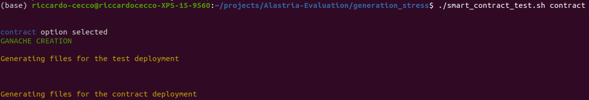
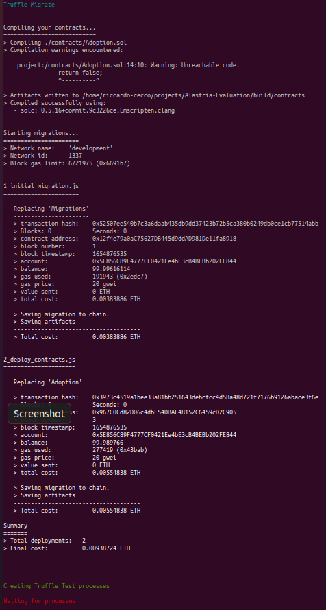

# Alastria-Evaluation
Read the Report.pdf file!!!

To execute the script you have to enter to generation_stress folder and execute `./smart_contract_test.sh contract`!
Logs are in the folder Log.
The script will generate 1 log file for each account and it will track all the transactions and the time spent for each one.
There will be also another file called `truffle_test_total` where all the time of the transactions will be visible in an unique file.

Example of execution:

